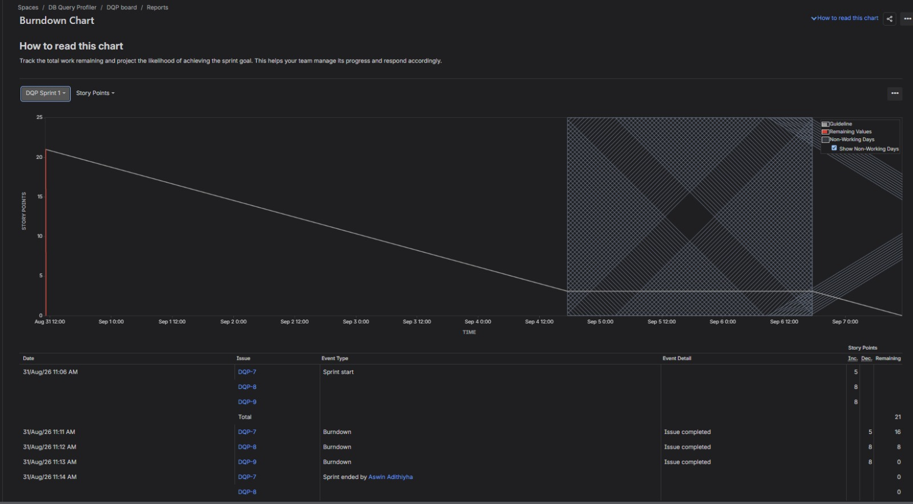
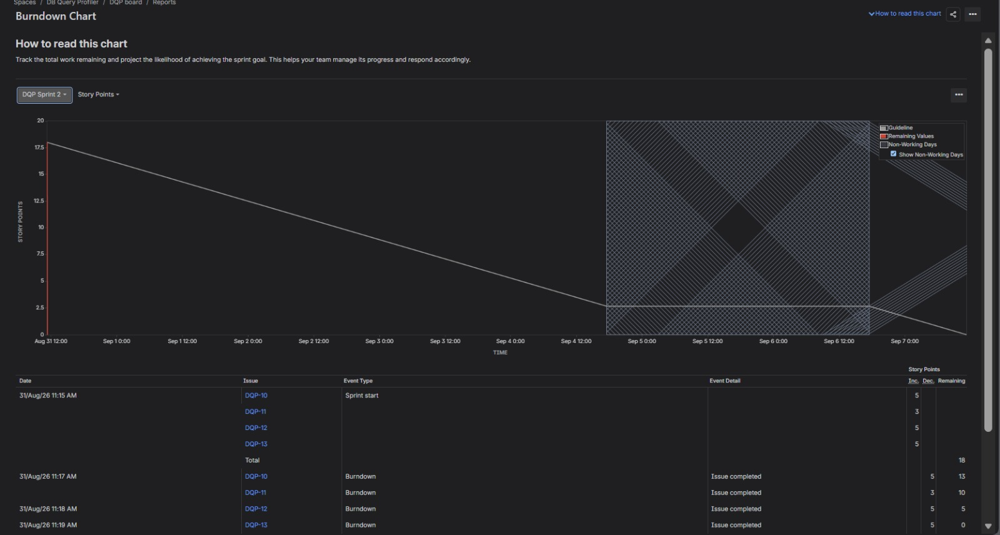

# Lab 2: Agile Backlog Creation & Sprint Simulation in Jira
## Database Query Performance Profiler — Jira SCRUM Board

**Project:** DB Query Profiler
**Board:** DQP board
**Methodology:** Scrum, 2 sprints (1 week each), Fibonacci story-point estimation

---

## 1. Backlog — Epics & User Stories

| Epic | Story | Description | Priority | Story Points |
|---|---|---|---|---|
| **Log Ingestion & Plan Parsing** | Automatic slow query log ingestion | As a DBA, I want slow query logs automatically ingested from Postgres/MySQL, so that I don't have to manually collect performance data. | High | 5 |
| **Log Ingestion & Plan Parsing** | Detect sequential scans via EXPLAIN plan parsing | As a DBA, I want the system to parse EXPLAIN plans and flag sequential scans on large tables, so that I can quickly spot poorly performing queries. | High | 8 |
| **Index Recommendation Engine** | Recommend index for detected sequential scans | As a DBA, I want the system to recommend a composite index when a sequential scan is detected, so that I can fix the query without manually analyzing it. | High | 8 |
| **Reporting & Alerting** | Weekly performance digest | As a Backend Lead, I want a weekly digest of the slowest queries and trends, so that I can prioritize optimization work. | Medium | 5 |
| **Reporting & Alerting** | Configurable alert thresholds | As a DBA, I want to configure alert thresholds, so that I'm notified immediately when a critical query regresses. | Medium | 3 |
| **Platform Reliability & Security** | High-throughput log ingestion without DB slowdown | As a DBA, I want log ingestion to handle 5,000 records/min without slowing the host DB, so that monitoring doesn't itself become a performance problem. | Medium | 5 |
| **Platform Reliability & Security** | Role-based access and encryption for query logs | As a DBA, I want query logs restricted by role and encrypted at rest, so that sensitive data isn't exposed. | Medium | 5 |

**Total backlog:** 4 Epics, 7 User Stories, 39 story points

---

## 2. Sprint Plan

### Sprint 1 — 21 points
The three highest-priority, foundational stories were sequenced first, since index recommendation depends on scan detection, which depends on ingestion.

| Story | Points | Status |
|---|---|---|
| Automatic slow query log ingestion | 5 | Done |
| Detect sequential scans via EXPLAIN plan parsing | 8 | Done |
| Recommend index for detected sequential scans | 8 | Done |

### Sprint 2 — 18 points
The remaining medium-priority stories covering reporting, alerting, and platform reliability.

| Story | Points | Status |
|---|---|---|
| Weekly performance digest | 5 | Done |
| Configurable alert thresholds | 3 | Done |
| High-throughput log ingestion without DB slowdown | 5 | Done |
| Role-based access and encryption for query logs | 5 | Done |

---

## 3. Burndown Charts

Both sprints burned down to zero story points remaining, indicating all committed work was completed within the sprint window.

---

## 4. Sprint Reflection

**Velocity:** Sprint 1 delivered 21 story points, Sprint 2 delivered 18 story points, for a combined 39 points across both sprints. Both sprints burned down to zero, meaning all committed stories were completed within the sprint window.

**What went well:** Grouping stories under epics (Log Ingestion & Plan Parsing, Index Recommendation Engine, Reporting & Alerting, Platform Reliability & Security) made backlog prioritization straightforward — the highest-priority, most technically foundational work (log ingestion, scan detection, index recommendation) was pulled into Sprint 1, since later stories like alerting and the weekly digest depend on that data pipeline existing first.

**Estimation accuracy:** Story points were assigned using the Fibonacci scale based on relative complexity rather than time — the two largest stories (8 points each) were "detect sequential scans via EXPLAIN plan parsing" and "recommend index for detected sequential scans," which matches intuition, since both require deeper logic (parsing execution plans, computing column selectivity) than more mechanical stories like configuring alert thresholds (3 points).

**Challenges:** Sequencing mattered more than raw priority — index recommendation can't be tested meaningfully without scan detection already working, so Sprint 1 was deliberately built around that dependency chain rather than picking the three highest-priority stories in isolation.

**Agile takeaway:** Splitting functional requirements into epics and user stories made the DB profiler's requirements far more actionable than the flat FR/NFR list from Lab 1 — each user story is now independently plannable, estimable, and demoable, which is the core value Agile decomposition adds over a traditional requirements document.
