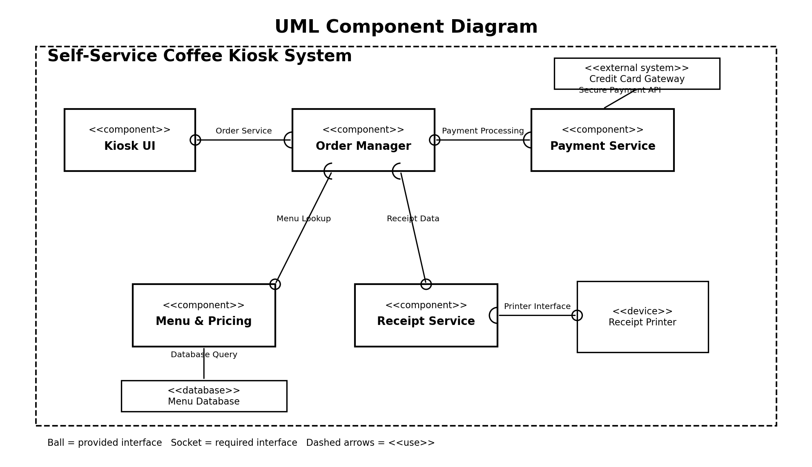

# Lab 3 – Component Modelling & Architectural Pattern Selection

## Scenario

Self-Service Coffee Kiosk System

## Architecture Selected

**Layered Architecture**

## Components

1. Kiosk UI
2. Order Manager
3. Payment Service
4. Menu & Pricing
5. Receipt Service

## UML Component Diagram

## Architecture Justification

The detailed architectural justification is provided in:

**Lab3_Architecture_Justification.pdf**
