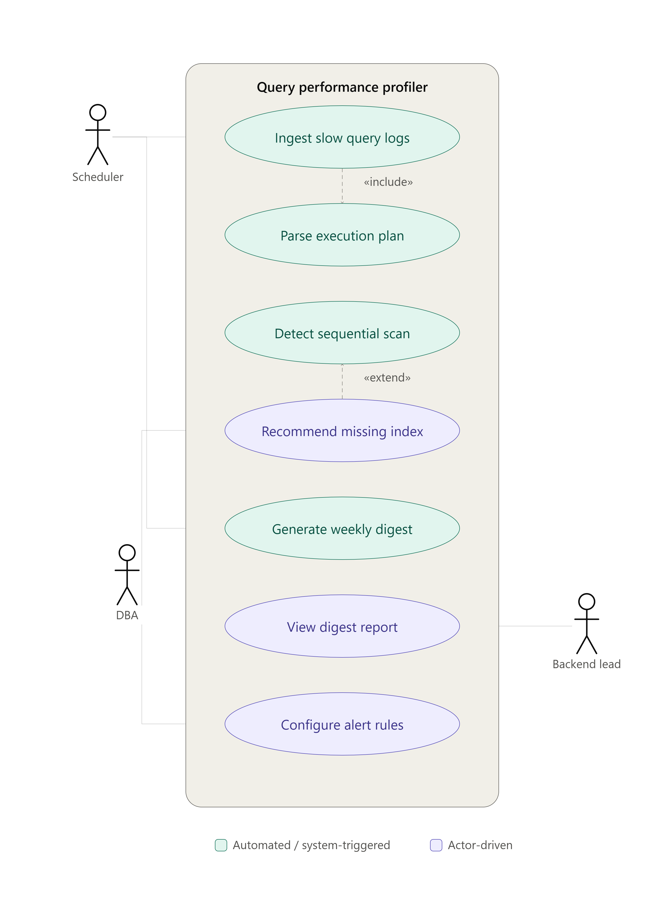

# Problem Statement #44 — Database Query Performance Profiler
## Requirements Engineering & UML Use-Case Modelling — Lab 1 Deliverables

**Stakeholders/Actors:** Database Administrator (DBA), Backend Lead, System Scheduler (secondary actor — triggers time-based ingestion and digest jobs)

---

## 1. Functional Requirements

| ID | Priority | Description | Acceptance Criteria | Rationale |
|---|---|---|---|---|
| FR-001 | High | The system shall continuously ingest slow query logs from PostgreSQL/MySQL sources (log-file tailing or `slow_query_log` tables) and parse each raw entry into structured fields: query text, execution time, timestamp, database name, calling host. | **Pass:** 1,000 consecutive log lines ingested with zero data loss and correctly parsed fields. **Fail:** any malformed or dropped record that isn't surfaced in an error log. | Every downstream feature (plan parsing, index recommendation, digesting) depends on reliable, structured raw data — this is the foundation the rest of the system is built on. |
| FR-002 | High | The system shall parse Postgres/MySQL `EXPLAIN` plans, identify sequential table scans on tables exceeding a configurable row-count threshold, and tag the offending query with the scanned table name and estimated row cost. | **Pass:** a seq scan on a table with >100K rows is flagged with the table name and cost. **Fail:** a seq scan on a large table goes unflagged, or a scan on a small lookup table is incorrectly flagged. | Sequential scans on large tables are the single most common root cause of slow queries; accurate detection is the trigger for every downstream recommendation. |
| FR-003 | High | When a sequential scan is detected, the system shall analyze the `WHERE`/`JOIN`/`ORDER BY` clauses of the query and recommend a composite index definition, with column order optimized by selectivity, that would eliminate the scan. | **Pass:** the recommended index covers every filtered/joined column, ordered most-selective-first. **Fail:** the recommendation omits a filtered column, or suggests indexing a column that's already indexed. | This is the tool's core value proposition — converting a detected problem into an actionable fix a DBA can run directly, rather than just a diagnosis. |
| FR-004 | Medium | The system shall generate a weekly digest summarizing the top N slowest queries, cumulative estimated time savings from applying suggested indexes, and a week-over-week trend comparison, delivered via email and dashboard. | **Pass:** digest is generated every 7 days, contains the top 10 queries and a week-over-week delta. **Fail:** digest is missed on schedule, or omits the trend comparison. | Aggregated, periodic reporting lets a Backend Lead prioritize optimization work without manually reviewing every log entry. |
| FR-005 | Medium | The system shall allow a DBA to configure a maximum-execution-time threshold per database; any query exceeding it shall trigger an immediate Slack/email notification rather than waiting for the weekly digest. | **Pass:** a query exceeding the configured threshold triggers a notification within 60 seconds. **Fail:** notification is delayed beyond 60 seconds or never sent. | Some regressions (e.g. a bad deploy) need immediate attention — real-time alerting complements, rather than duplicates, the weekly digest. |

---

## 2. Non-Functional Requirements

| ID | Type | Description | Acceptance Criteria | Rationale |
|---|---|---|---|---|
| NFR-001 | Performance | Slow query log ingestion must handle up to 5,000 log records per minute without dropping entries or measurably slowing the host database (<2% added CPU overhead on the monitored DB). | **Pass:** benchmark confirms 5,000 records/min sustained with <2% added CPU load on the host DB. **Fail:** throughput falls below 5,000/min, or host DB CPU overhead exceeds 2%. | The profiler must be a passive observer — if ingestion competes for DB resources, it defeats its own purpose of making queries faster. |
| NFR-002 | Security | The system shall restrict access to query log data via role-based access control (only DBA and Backend Lead roles may view raw query text) and encrypt stored logs at rest using AES-256. | **Pass:** a user without DBA/Backend Lead role is denied access; stored logs are verified encrypted. **Fail:** an unauthorized role can view raw query text, or logs are stored in plaintext. | Slow query logs frequently contain literal parameter values (e.g. `WHERE email = '...'`) that can include PII — this is a compliance-critical control, not optional hardening. |

---

## 3. UML Use-Case Diagram

**Actors**
- **Database Administrator (DBA)** — configures alert rules, reviews/approves index recommendations
- **Backend Lead** — views the weekly digest report
- **System Scheduler** (secondary/timer actor) — triggers log ingestion and weekly digest generation

| # | Use Case |
|---|---|
| 1 | Ingest slow query logs |
| 2 | Parse execution plan |
| 3 | Detect sequential scan |
| 4 | Recommend missing index |
| 5 | Generate weekly digest |
| 6 | View digest report |
| 7 | Configure alert rules |

**Relationships**

| Type | From → To | Why |
|---|---|---|
| «include» | Ingest slow query logs → Parse execution plan | Parsing is a mandatory sub-step that always executes as part of ingestion; it has no independent trigger. |
| «extend» | Recommend missing index → Detect sequential scan | The extension point fires only when a scan is found on a table over the row threshold; most parsed queries never reach this use case. |

**Associations**

| Actor | Use Case(s) |
|---|---|
| System Scheduler | Ingest slow query logs, Generate weekly digest |
| DBA | Recommend missing index (review/approve), Configure alert rules |
| Backend Lead | View digest report |

---

## 4. Use-Case Flow Specification

See [`docs/use-case-flow-spec.md`](docs/use-case-flow-spec.md).
